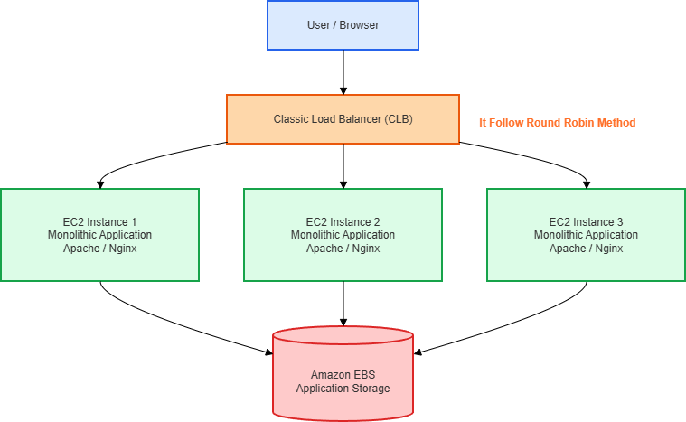

# Monolithic Application Deployment on AWS using Classic Load Balancer

## Project Overview

This project demonstrates the deployment of a **Monolithic Application on AWS** using a **Classic Load Balancer (CLB)** and **three EC2 instances**.

The main purpose of this project is to understand how traffic is distributed across multiple EC2 instances using a load balancer while hosting the same application on all servers.

When users access the application, the **Classic Load Balancer** distributes incoming traffic between **three EC2 instances**, improving availability and reliability.

---

## Architecture Diagram

Add your architecture image here.


# Architecture Explanation

The architecture consists of the following AWS components:

## 1. User / Browser

The application starts when a **user accesses the website through a browser**.

The user sends a request using the **DNS URL of the Classic Load Balancer**.

Example:

```text
http://classic-load-balancer-dns
```

The browser sends the request to AWS infrastructure.

---

## 2. Classic Load Balancer (CLB)

The **Classic Load Balancer (CLB)** acts as the main traffic manager.

Responsibilities of CLB:

- Receives incoming requests from users
- Distributes traffic among EC2 instances
- Performs health checks
- Improves availability of the application

### Traffic Distribution Method

This project uses the:

```text
Round Robin Method
```

In Round Robin, requests are distributed sequentially across servers.

Example:

```text
Request 1 → EC2 Instance 1
Request 2 → EC2 Instance 2
Request 3 → EC2 Instance 3
Request 4 → EC2 Instance 1
```

This helps balance traffic equally.

---

## 3. EC2 Instances (Application Servers)

The project contains **three EC2 instances**.

Each EC2 instance hosts:

- Monolithic Application
- Apache Web Server
- Application Files
- Attached Storage

### EC2 Instance 1

Runs the complete monolithic application.

Technology used:

```text
Apache 
```

---

### EC2 Instance 2

Hosts the same application as Instance 1.

This server receives traffic from the Classic Load Balancer.

---

### EC2 Instance 3

Hosts the same monolithic application.

Helps improve availability and fault tolerance.

---

## 4. Monolithic Architecture

This project follows a **Monolithic Architecture**.

In monolithic architecture:

- Frontend and backend exist together
- Entire application runs on a single server
- Same application is deployed on multiple EC2 instances

Since all EC2 servers contain the same application, the load balancer can send traffic to any healthy server.

---

## 5. Amazon EBS (Elastic Block Store)

Amazon EBS is used for:

- Application storage
- Persistent data storage
- File storage

Even if an EC2 instance restarts, the data remains available.

---

## AWS Services Used

- Amazon EC2 – To host the monolithic application
- Classic Load Balancer (CLB) – To distribute traffic between EC2 instances
- Amazon EBS – Storage attached to EC2 instances
- VPC (Virtual Private Cloud) – Network isolation
- Public Subnets – To deploy resources
- Security Groups – To allow HTTP, HTTPS, and SSH access

---
## Prerequisites

Before starting this project, make sure you have:

- AWS Account
- Basic Linux Knowledge
- AWS EC2 Understanding
- SSH Client / Terminal
- Internet Connection
- LEMP/LAMP

---

# Step 1: Launch EC2 Instances

Launch **3 EC2 instances**.

| Setting | Value |
|---------|-------|
| AMI | Amazon Linux  |
| Instance Type | t3.micro |
| Count | 3 |
.png>)
### Security Group 
Select Security Group that allows HTTP and SSH port we have to use same SG on Load Balancer
### Instance Names

- Server-1
- Server-2
- Server-3

---

# Step 2: Install Apache Web Server

Connect to each EC2 instance and run:

## Update packages

```bash
sudo yum update -y
```

## Install Apache

```bash
sudo yum install httpd -y
```

## Start Apache

```bash
sudo systemctl start httpd
sudo systemctl enable httpd
```

---

# Step 3: Deploy Monolithic Application

Move to web directory:

```bash
cd /var/www/html
```

Create HTML file:

```bash
sudo vim index.html
```

Paste your application code.

### Server Identification

For Server 1:

```html
Server-1
```

For Server 2:

```html
Server-2
```

For Server 3:

```html
Server-3
```
.png>)
---

# Step 4: Create Classic Load Balancer

1. Go to **EC2 Dashboard**
2. Click **Load Balancers**
.png>)
3. Create **Classic Balancer**
.png>)
4.  Create **Classic Balancer**
.png>)
.png>)


### Basic Configuration
- Use Internet Facing because we have allow LB to handel trafic from internet
- When will we use Internal it use only for internal LB
.png>)

- Availability Zones and Subnets choose where we have to create your LB, We also check all because we don't know where our EC2 instance are created 
.png>)

- Select Security Group that having HTTP port because our LB handel HTTP trafic
.png>)


- Register all **3 EC2 instances**.
.png>)
.png>)
.png>)


# Step 5 : Wait for avalibility of LB until status is 3 of 3
.png>)
.png>)


---

# Step 6: Test the Application

Copy the **DNS name** of the Classic Load Balancer.
.png>)

Open in browser:

```text
http://your-load-balancer-dns
```

Refresh multiple times.

You will see requests switching between:

-  Server 1
.png>)

-  Server 2
.png>)

-  Server 3
.png>)


This confirms that the **Classic Load Balancer is distributing traffic successfully in the form of round robin**.

---

## Project Outcome

Successfully deployed a **Monolithic Application on AWS** using:

- Classic Load Balancer
- 3 EC2 Instances
- VPC and Public Subnets
- Security Groups
- Apache Web Server
- Amazon EBS Storage

---

## Learning Outcomes

From this project, I learned:

- AWS VPC Networking
- Public Subnets
- EC2 Deployment
- Security Groups
- Classic Load Balancer
- Monolithic Architecture
- Apache Web Server Deployment
- Traffic Distribution in AWS

---

## Author

**Sanket Gadade**  
AWS | Linux | DevOps Enthusiast