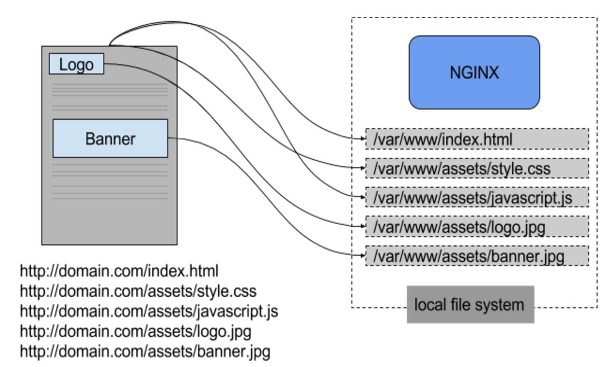

# Static Website Deployment on Nginx (Windows)

##  Project Description
This project demonstrates how to deploy a static website on a local Windows machine using Nginx.

---

##  Tech Stack
- Windows OS
- Nginx
- HTML, CSS

---
## Architecture

##  Step-by-Step Implementation

### 1. Download Nginx
 Download Nginx (Windows version) from official website
.png)
.png)
### 2. Extract Files
Extract to:
C:\nginx
.png)
### 3. Start Nginx
cd C:\nginx
start nginx

### 4. Verify Server
Open browser:
http://localhost
.png)

### 5. Deploy Website Files
Go to:
C:\nginx\html
# Replace default files with your website

### 6. Reload Nginx
nginx -s reload

### 7. Stop Nginx (Optional)
nginx -s stop

---

##  Access the Website
http://localhost
.png)
---

-

##  Features
- Local hosting environment
- Lightweight server
- Easy testing setup

---

##  Learning Outcomes
- Nginx setup on Windows
- Local deployment process
- Testing before production

## Conclusion
Deploying Nginx on a local Windows machine provides a simple and efficient way to host and test static websites. It helps in understanding basic web server configuration, file handling, and local development environments. Overall, this setup is useful for beginners to practice deployment before moving to cloud or production environments.