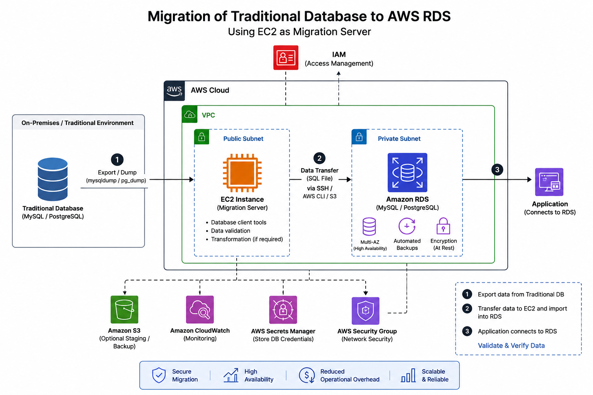

# Student Registration Form 

## Introduction
The Student Registration System is a web-based application designed to simplify the process of collecting and managing student information in a structured and efficient way. This project has been developed and deployed using the LEMP stack (Linux, Nginx, MySQL, PHP), which is widely used for building scalable and high-performance web applications.

The system provides a user-friendly interface where users can enter student details such as name, email, and course, which are then securely stored in a MySQL database. The backend logic is handled using PHP, while Nginx acts as the web server to efficiently process client requests.

The primary objective of this project is to demonstrate practical knowledge of web development, server configuration, and application deployment. It also helps in understanding how different components of the LEMP stack work together to deliver a fully functional web application.

This project serves as a foundation for building more advanced systems with additional features like authentication, data management, and cloud-based deployment.

## Architecture Diagram

### Description:
 1. User / Client (Browser)
This is the starting point of your system.
The user opens the website in a browser (Chrome, Edge, etc.).
They fill out the student registration form and click submit.
 This sends an HTTP/HTTPS request to the server.

2. Nginx (Web Server)
Nginx acts as the gateway of your application.
It receives all requests from the user.
What Nginx does:
Serves static files (HTML, CSS, JS)
Forwards dynamic requests to PHP (via PHP-FPM)
Think of Nginx as a traffic controller.

 3. PHP (Application Logic)
PHP handles the main logic of your system.
What PHP does:
Receives data from Nginx
Validates form input
Processes student data
Connects to database
This is the brain of your application.

 4. MySQL (Database)
MySQL is used to store student information.
What MySQL does:
Stores records (name, email, course)
Executes queries (INSERT, SELECT)
Returns results to PHP
This is the storage part of your system.

 5. Linux File System
Stores your project files in:
/var/www/html/
Includes:
PHP files
HTML/CSS files
Config files
 Nginx serves files from here, and PHP reads from here.
## Steps 
#### Step 1: Lunch instance with SSH and HTTP security Groups

#### Step 2: Create a LEMP.sh file and write a scripting to run all cammand at a time

#### Step 3: Here we Write a Script 

#### Step 4: Run this file with cammand bash LEMP.sh -> for execute the file 

#### I was already install it that's why it shows completed

#### Step 5: Here we have to create a signup.html for get data from student in the form

#### Step 6: After that i have to create a PHP file to get the jason data from signup.html and send it to the database.In this submit.php we are creating a database connection at // Database Connection

#### Step 7:  Here we created a database and table of user to store info

#### Here we go our signup.html->submit.php->FCT Database 

## Summary
The Student Registration System is built using the LEMP stack, where the user interacts with the application through a web browser. The request is handled by Nginx, which serves static content and forwards dynamic requests to PHP. PHP processes the data, applies business logic, and communicates with MySQL to store or retrieve student information. Finally, the response is sent back to the user through Nginx.
