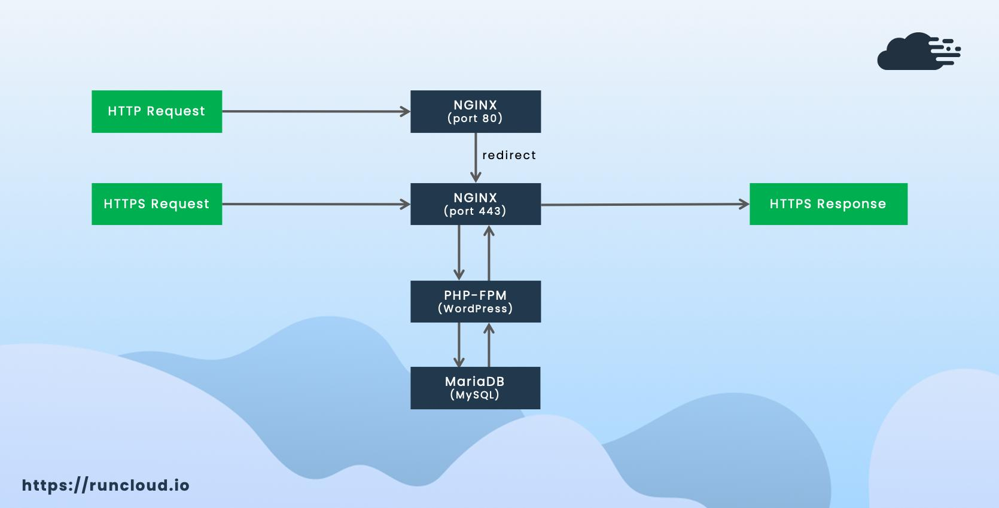

## Introduction
This project demonstrates the deployment of a WordPress website on a cloud environment using AWS. It covers setting up a web server, database configuration, and hosting a fully functional dynamic website.

## Architecture

## Step by step explaination how to deploye wordpress website
 
 ### Step1: Create a Instance
 .png)

 ### Step2: update a instance and install services and run it using shellscript
 .png)

 ### run .sh file
 .png)

 ### Step 3: Ensure all service are running using 
 sudo systemctl status "services names"
 .png)

 #### See apache user created by the system 
 .png)

 ### Step 4: We have to install Package php8.5-mysqlnd.x86_64 
 This is the connector between php and mysql
 .png)

 ### Step 5:  Get the website link from wordpress using wget "url"
 .png)

 ### Step 6: lates untar the the .tar file 
 .png)
 .png)

### Step 7 : Create a Database and wordpress can automatically create a table and add data 
.png)

### Step 8: go to the browser and check for the access using your_ip/wordpress/
here you see this page click on let's go
.png)

### Step 9: Add info and click on submit
.png)

### Step 10: Here wordpress uable to get the access of /wordpress in the /var/www/html
.png)

### Step 11: check the permissions of wordpress 
.png)

### Step 12: change the permission of wordpress
.png)

### Step 13: now refresh or resubmit it
.png)
.png)

### Step 14: click on run the installation and fill the form
.png)
.png)

### Step 15: once it success login as a admin using root
.png)
.png)

### Step 16: See in the database changes done by wordpress
.png)

### Step 17: after this you can add the blog in it and publish it
.png)
.png)

### Step 18: See your Blog is published
.png)
